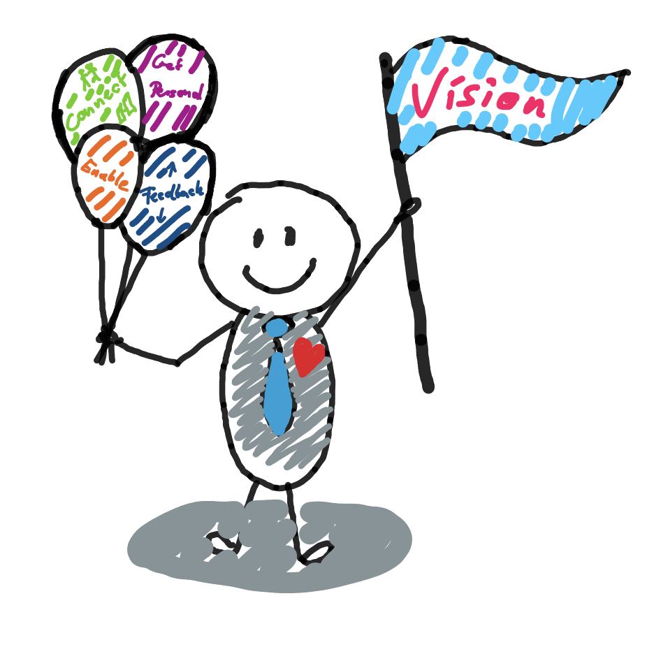

# 🏡 Home 

## Vision

The vision behind this page is to build an "open-source" community for leadership!
The community consists of leadership enthusiasts which collaborately discuss and define modern leadership practices on this platform.  

Use this platform to reflect my leadership style and provide it as an example to the community.

<object data="assets/test.drawio.svg"></object>

## What does a modern leader need?

{width=400px}

### Positivity

### Empathy (Listening)

### Focus

### Speed

## Different models to structure leadership

## Core characteristics of modern leaders

* Positive
* Empathy
* Focused
* Concise Communicators

## Definitions of Leadership

* Leadership means serving
* True leaders don't create followers they create other leaders!

## Difference between Leader and Manager

Manager - Focus on efficiency

Leader - Focus on vision, strategic decisions