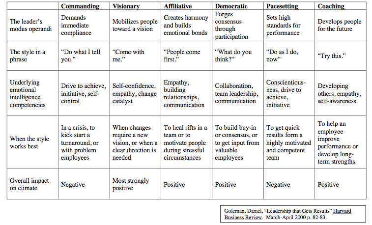

# Leadership Styles

## Leadership styles by Harvard Business Review

Harvard Business Review describes the top 10 common leadership styles:

* Coercive: Leaders demand immediate compliance.
* Authoritative: Leaders mobilize people toward a vision.
* Affiliative: Leaders create emotional bonds and harmony.
* Democratic: Leaders build consensus through participation.
* Pacesetting: Leaders expect excellence and self-direction.
* Coaching: Leaders develop people for the future.
* Bureaucratic leadership, whose leaders focus on following every rule.
* Charismatic leadership, in which leaders inspire enthusiasm in their teams and are energetic in motivating others to move forward.
* Servant leadership, whose leaders focus on meeting the needs of the team.
* Transactional leadership, in which leaders inspire by expecting the best from everyone and themselves.

## Six Leadership styles according to Daniel Goleman

{width=800px}

### Combination of leadership styles for best performance

{width=600px}

