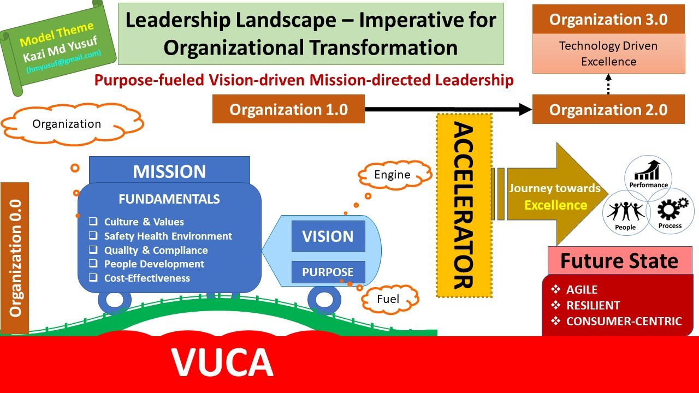

# Leadership views

{width=400px}

### Positivity

### Empathy (Listening)

### Focus

### Speed

## Different models to structure leadership

## Core characteristics of modern leaders

* Positive
* Empathy
* Focused
* Concise Communicators

## Definitions of Leadership

* Leadership means serving
* True leaders don't create followers they create other leaders!

## Difference between Leader and Manager

Manager - Focus on efficiency

Leader - Focus on vision, strategic decisions