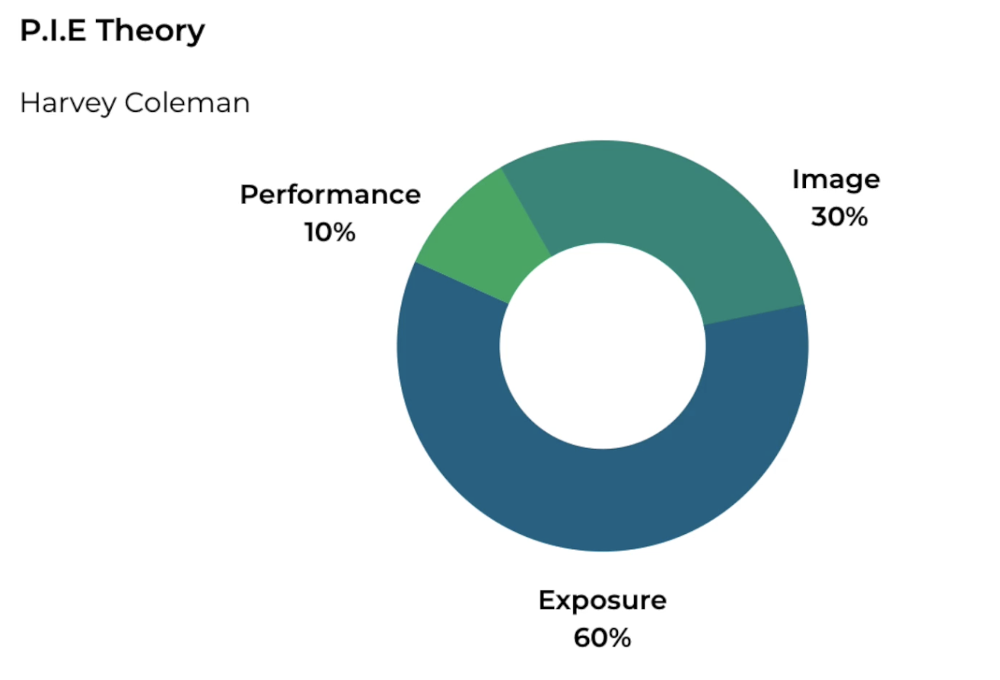

# Career

## Success Factors for career

### P.I.E Theory

Career success is based on the three key elements of performance, image, and exposure. What's become known as the P.I.E theory of career progress.

{width=400px}

#### Performance

doing a great job is expected of everybody. It's the minimum required, and it's mandatory.

#### Image

So who are you as an individual? What do people think of you? How do you come across? And what's your reputation? As we said before, your reputation is what somebody says about you when you're not in the room. Your reputation follows you around, but also sometimes precedes you. Do you bring problems or do you bring solutions? When people look at you, can they see you at the next level. Before you get the part, you have to look and sound the part.

#### Exposure

E of the P.I.E theory stands for exposure. And Coleman claims it contributes 60% to career progress. So who knows about you and what you do? Who's seen you in action? Who's seen you perform at meetings? What's your boss think of you? What's your boss's boss think of you? What are you known for within the company? What do you know for outside of the company? You need to become known, not famous. What would you be a go-to person for? Do you just do invisible work or do you do visible work? Are you getting exposure, positive exposure to the right people? Have you a life bigger than your job? Do you over-deliver in everything that you do?
Well, you have to over-deliver in everything you do, innovate, help others, volunteer, make suggestions, ask for more responsibility, have a life bigger than your job, be active in your community, seek out and learn new skills, be a mentor, do stuff. And finally, be curious.

### Networking

The career ladder is more like a jungle gym. The vertical world of hierarchies has been replaced by a horizontal world of networks and teams. And there's now such a thing as network intelligence, and acceptance that there are more smart people outside your company than inside your company. And your network and your employees' networks can be a way of finding out what's happening in your industry, your sector, your segment, in your geography. So now you have to see networking as a career management tool.

Results get you here, relationships get you there.
